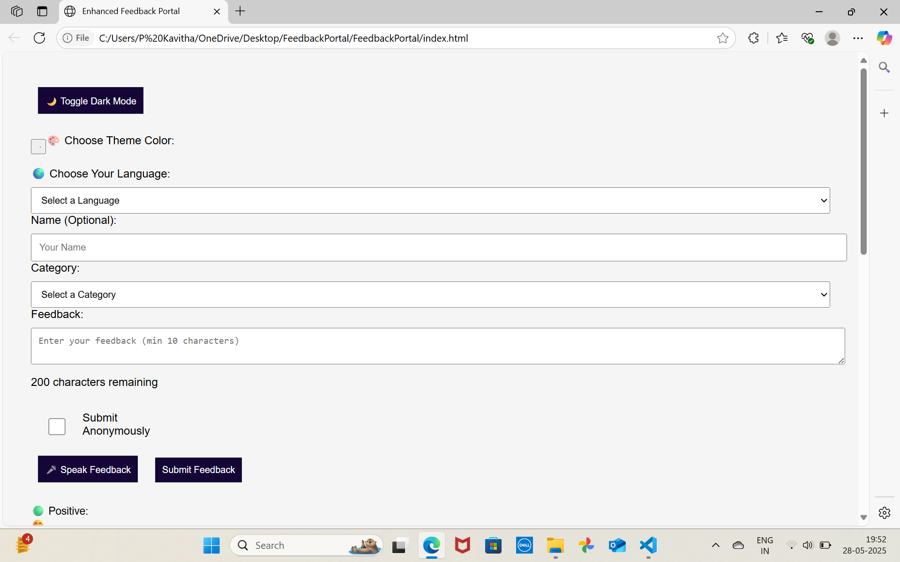
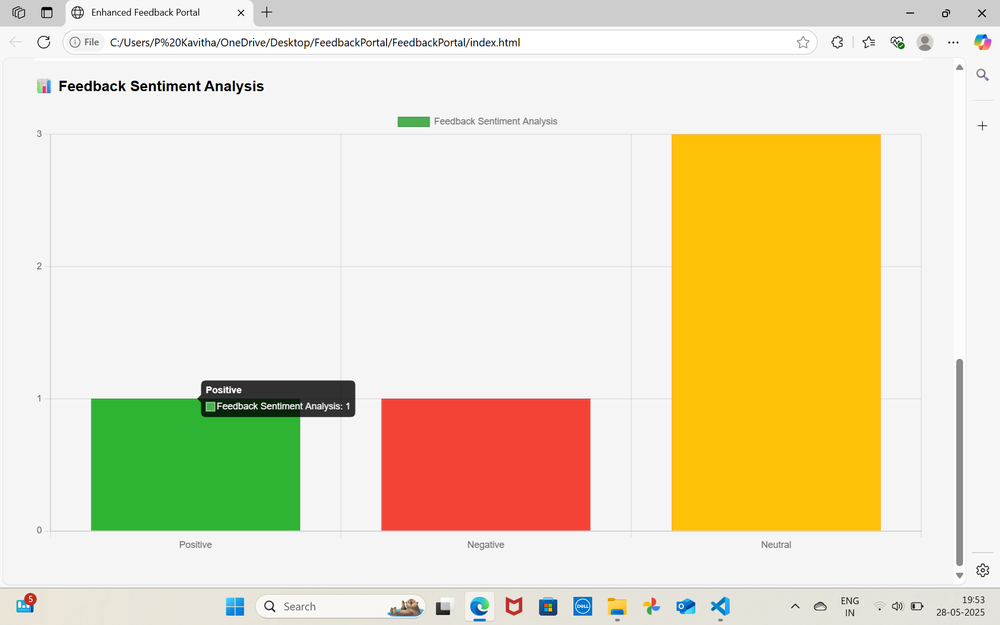
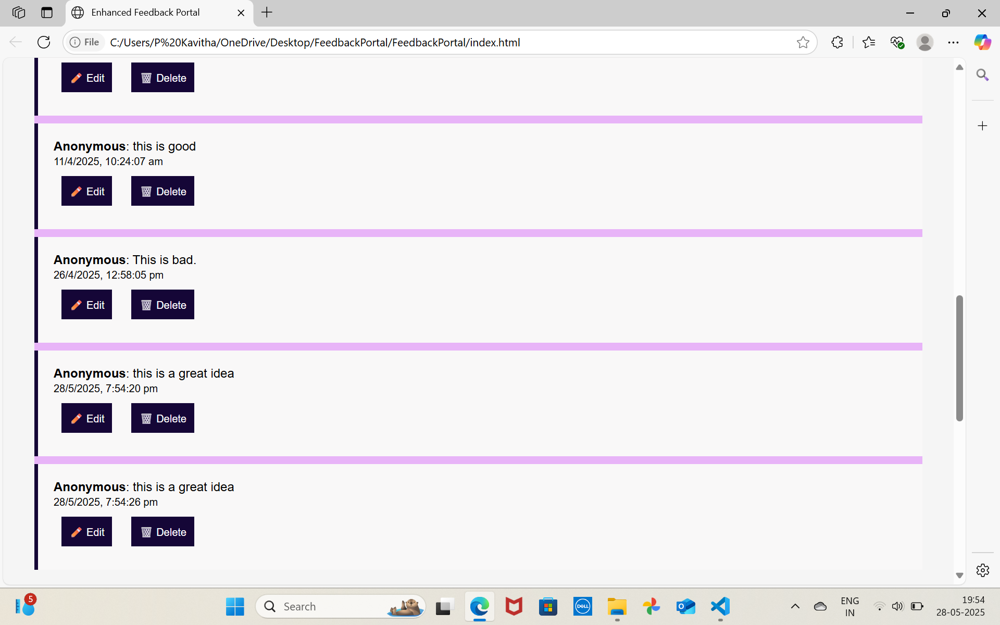

# Community-Feedback-Portal
# 🌍 Enhanced Community Feedback Portal  

An advanced, interactive **feedback collection platform** with multi-language support, customizable themes, voice input, and live sentiment analysis.  
Designed for communities, events, and organizations to easily collect, view, and analyze user feedback in real time.  

  

---

## ✨ Features
- 🌐 **Multi-Language Support** – Supports **80+ languages**, from English to regional and indigenous ones.  
- 🌓 **Dark Mode Toggle** – Switch between light and dark mode instantly.  
- 🎨 **Theme Color Picker** – Choose your own UI accent color.  
- 🎤 **Voice Feedback** – Record feedback using speech recognition.  
- 📝 **Categorized Feedback** – Select type: Bug Report, Feature Request, Support, or General.  
- 📊 **Real-Time Sentiment Analysis** – Visual chart representation of feedback mood.  
- 😊 **Mood Board** – Quick emoji reactions for mood indication.  
- 🔢 **Character Counter** – Live count to limit feedback length.  
- 📱 **Responsive Design** – Works seamlessly on desktop and mobile.  

---

## 📂 Project Structure
index.html # Main HTML file
style.css # Styles and dark mode/theme settings
script.js # Feedback form logic, validation, and interactions
chart.js # Chart.js configuration for sentiment analysis
screenshot.png # Project screenshot (add your own)

## 📸 Screenshot

---

## 🛠️ Technologies Used
- **HTML5** – Structure and form elements  
- **CSS3** – Responsive design, dark mode, and theme colors  
- **JavaScript (Vanilla)** – Form logic, validation, dark mode, color picker  
- **Chart.js** – Sentiment analysis visualization  
- **SpeechRecognition API** – Voice-to-text feedback input  

---

💡 **Future Enhancements**
- Store feedback in a **database** (Firebase, MongoDB, etc.)  
- Add **admin dashboard** for moderation and analytics  
- Enable **email notifications** for new feedback  
- Implement **leaderboard** for top contributors

---

## 📜 License
This project is licensed under the **MIT License** 

  

---
